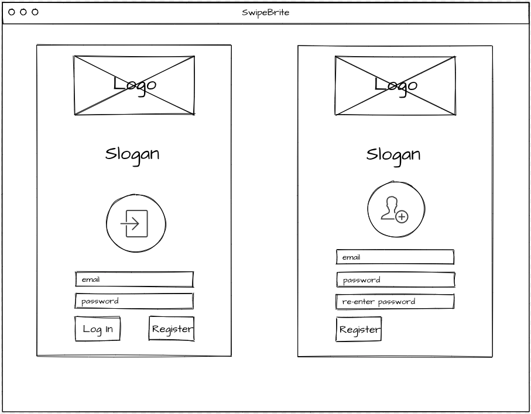
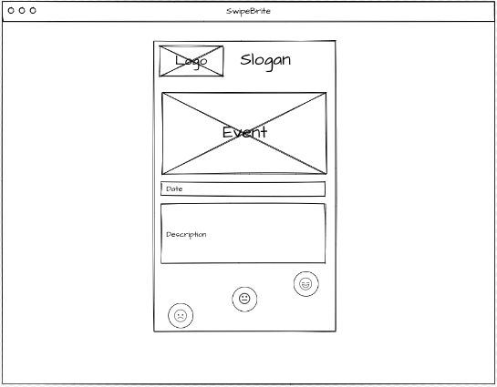
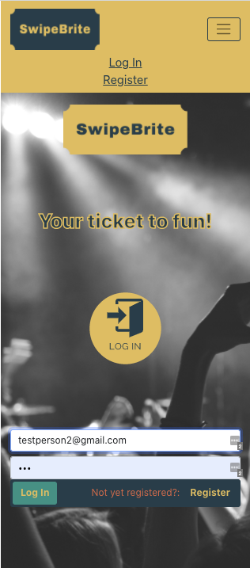
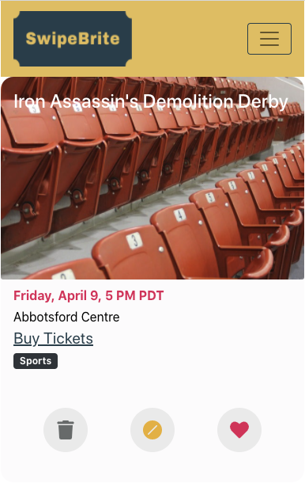
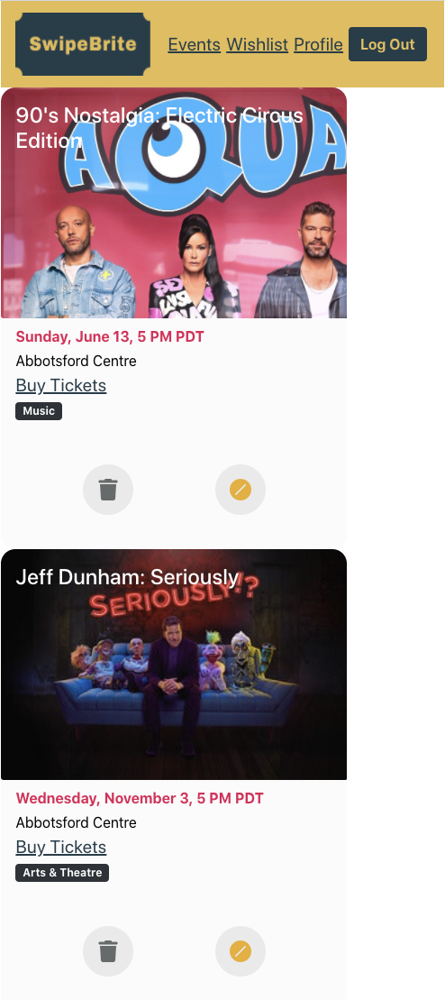

# SwipeBrite

## Suffering from Covid _cabin fever_? Cure your ills with **SwipeBrite**!

Covid-safe good times await, just swipe right with [_SwipeBrite_](https://swipebritefrontend.herokuapp.com/)!

SwipeBrite uses an API and your current location to show you events happening near you.

SwipeBrite is similar to Tender (on mobile; desktop contains buttons):

- swipe right to save that event
- _since tastes can change from one day_, swipe left to merely not have that event show up for the remainder of the day
- swipe DOWN to never have that event show up again

## Initial Wireframes

## App Screenshots

## Technologies Used

- Languages
  - [HTML](https://www.w3schools.com/html/)
  - [CSS](https://www.w3schools.com/css/)
  - [JavaScript](https://www.w3schools.com/js/)
- Frameworks
  - [Express.js](https://expressjs.com/)
- Runtime Environment
  - [Node.js](https://nodejs.org/en/)
- Libraries
  - [React](https://reactjs.org/)
  - [Mongoose](https://mongoosejs.com/)
  - [Bootstrap 4](https://getbootstrap.com/)
- Database Programs
  - [MongoDB](https://www.mongodb.com/)
- APIs
  - [Ticketmaster's Discovery API](https://developer.ticketmaster.com/products-and-docs/apis/discovery-api/v2/)

## Getting Started

Planning for our app was done via GitHub:

- [Front End](https://github.com/rhine1217/SwipeBrite_App/projects/1)
- [Back End](https://github.com/maresl/SwipeBrite/projects/1)

SwipeBrite is deployed via Heroku:

- [Front End](https://swipebritefrontend.herokuapp.com/)
- [Back End](https://blooming-everglades-09316.herokuapp.com/)

## Unsolved Problems

The following are the unsolved problems we have with this app:

- Implement dislike functionality (right now dislike and blacklist are both the same)
- Cards should centered on events page

## Future Enhancements

The following are the future enhancements we'd like to include in this app:

- Expand each item into details provided by the TicketMaster API
- Filter by genre, price range, age limitation, items that are on sale...and other filters available via TicketMaster
- Add search capability
- Add avatar & password update on Profile page
- Be able to adjust mileage radius for pulling events
- Share links with friends

Front End Repo
https://github.com/rhine1217/SwipeBrite_App

Back End Repo
https://github.com/maresl/SwipeBrite
